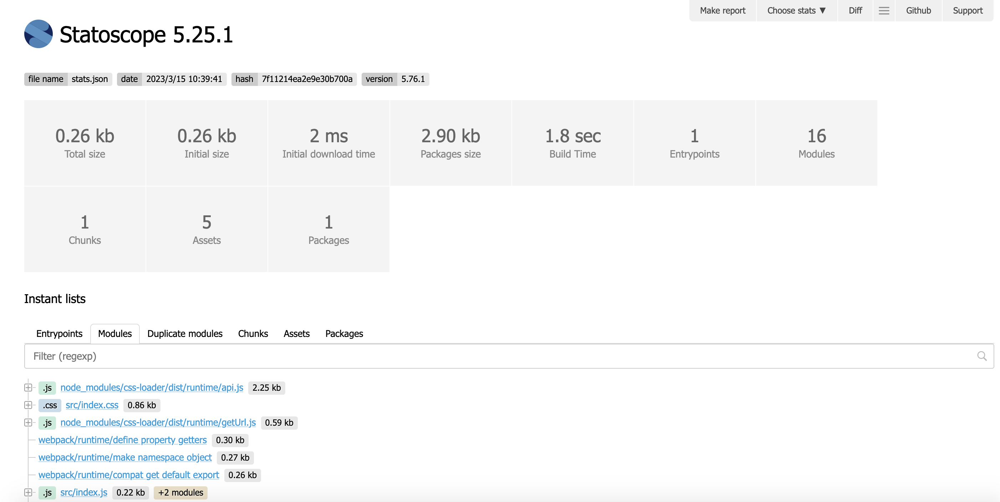

# Webpack简单入个门

`个人学习笔记`

### 特点
* 一致且开放：
  + 一致性，可以忽略资源之间的差异：
    - 所有资源都是 Module；
    - 借助Loader，Webpack几乎可以处理任意类型资源；
  + 开放性：
    - 可以轻松接入TS、Babel等JS编译工具；Less、Sass等CSS预处理器；

### 理解
`Webpack打包流程大致可以划分：输入 -> 模块处理 -> 后处理 -> 输出`

#### 流程
* 输入：从文件系统读入文件
* 模块处理：根据文件类型调用对应Loader，将结果转为AST，并分析依赖关系，进一步递归处理所有依赖文件
* 后处理：待所有模块处理完毕后执行，包括模块合并、注入运行时、产物优化。最终输出Chunk集合
* 输出：将Chunk写出到外部文件系统

#### 流程相关配置项
* 输入输出：
  + entry：定义项目入口文件
  + context：项目执行上下文路径
  + output：配置产物输出路径、名称等
* 模块处理：
  + resolve：配置模块路径解析规则
  + module：配置模块加载规则
  + externals：声明外部资源，Webpack会忽略这部分资源，跳过这些资源的解析和打包工作
* 后处理：
  + optimization：优化产物包体积
  + target：配置目标产物的目标运行环境
  + mode：声明环境
* 其他提效工具：
  + 开发效率：
    - watch：持续监听文件变化，持续构建
    - devtool：配置Sourcemap生成规则
    - devServer：配置HMR相关
  + 性能优化：
    - cache：缓存编译信息和编译结果
    - performance：配置产物超过阈值，如何告知开发者
  + 日志类：
    - stats：精确控制编译过程的日志内容
    - infrastructureLogging：控制日志输出方式

#### 常用工具
* Babel

```javascript
  // webpack.config.js
  module.exports = {
    modules: {
      rules: [
        {
          test: /\.js$/,
          use: {
            loader: 'babel-loader',
            options: {
              presets: ['@babel/preset-env']
            }
          }
        }
      ]
    }
  };
```

* TS

```javascript
  // webpack.config.js
  module.exports = {
    modules: {
      rules: [
        {
          test: /\.ts$/,
          use: ['ts-loader']
        }
      ]
    },
    resolve: {
      extensions: ['.ts', '.js']
    }
  }
```

* ESLint

```javascript
  // .eslintrc
  {
    "extends": "standard"
  }
```

```javascript
  // webpack.config.js
  const path = require('path');
  const ESLintPlugin = require('eslint-webpack-plugin');

  module.exports = {
    entry: './src/index',
    mode: 'develop',
    output: {
      filename: '[name].[contenthash].js',
      path: path.join(__dirname, 'dist')
    },
    plugins: [new ESLintPlugin({ extensions: ['.js', '.ts'] })]
  }
```

* css
  + css-loader：解析css内容
  + style-loader：将css内容注入到页面`<style>`标签内
  + mini-css-extract-plugin：将css代码单独抽离成`.css`文件，通过`<link>`标签插入到页面
  
```javascript
  // webpack.config.js
  const HTMLWebpackPlugin = require('html-webpack-plugin');
  const MiniCssExtractPlugin = require('mini-css-extract-plugin');

  module.exports = {
    modules: {
      rules: [
        {
          test: /\.css$/i,
          use: [
            process.env.NODE_ENV === 'develop' ? 'style-loader' : MiniCssExtractPlugin.loader,
            "css-loader",
            {
              loader: 'postcss-loader',
              options: {
                postcssOptions: {
                  plugins: [require('autoprefixer')]
                }
              }
            }
          ]
        }
      ]
    },
    plugins: [
      new MiniCssExtractPlugin(),
      new HTMLWebpackPlugin()
    ]
  }
```

* img
  + file-loader：将图像引用转为url语句并生成相应图片文件
  + url-loader：设定阈值`limit`，对于小于阈值图片直接转为`base64编码`；大于阈值的图片则调用file-loader加载

```javascript
  // webpack.config.js
  module.exports = {
    module: {
      rule: [{
        test: /\.(png|jpg|jpeg)$/,
        use: [{
          loader: 'url-loader',
          options: {
            limit: 1024
          }
        }]
      }]
    }
  }
```

### 核心流程细解
* 初始化阶段：
  + 初始化参数：从配置文件、配置对象、shell参数中读取，与默认配置结合得出最终配置
  + 创建编译器对象：用参数创建`Compiler`对象
  + 初始化编译环境：注入内置插件、注入模块工厂、初始化RuleSet集合、加载配置的插件等
  + 开始编译：执行`Compiler`对象的run方法，创建`Compilation`对象
  + 确定入口：根据配置的`entry`找出所有的入口文件，调用`compilation.addEntry`将入口文件转换为`dependence`对象
* 构建阶段：
  + 编译模块(make)：从`entry`文件开始，调用对应`loader`将模块转为标准JS内容，调用JS解析器将内容转为AST对象，从中找出该模块的依赖模块，再递归处理依赖模块，直到所有入口依赖的文件都经过编译处理完毕
  + 完成模块编译：得到上一步完成后所有被依赖模块的编译内容和它们之间的依赖关系图
* 封装阶段：
  + 合并(seal)：根据入口和模块之间的依赖关系，组装成一个个包含多个模块的`Chunk`
  + 优化(optimization)：对`Chunk`做进一步优化，包括tree-shaking、terser、压缩等
  + 写入文件系统(emitAssets)：根据配置确定输出的路径和文件名，把文件内容写入到文件系统

### 性能
* 可能引起的性能问题：
  + 构建阶段
    - 需要将文件的相对引用路径转为绝对路径，这个过程可能涉及多次IO操作，执行效率取决于文件`层次深度`
    - 找到具体文件后，需要读入文件内容并调用`LoaderRunner`遍历Loader数组完成内容编译，这个过程需要执行密集CPU操作，执行效率取决于`Loader的数量与复杂度`
    - 需要将标准JS内容转为AST，并遍历AST找出模块的依赖资源，这个过程层需要执行密集CPU操作，执行效率取决于`代码复杂度`
    - 递归处理依赖资源，执行效率取决于`模块数量`
  + 封装阶段：
    - 根据`splitChunks`配置、`entry`配置，动态模块引用语句等，确定模块与Chunk映射关系，其中`splitChunks`相关的分包算法非常复杂，涉及大量CPU计算
    - 根据`optimization`配置执行一系列产物优化操作，其中诸如`Terser`插件需要执行大量AST相关计算，执行效率取决于`产物代码量`
* 性能分析-如何收集、分析Webpack打包过程的性能数据：
  + 数据收集
    - 添加`profile: true`配置
    ```javascript
      // webpack.config.js
      module.exports = {
        // ...
        profile: true
      }
    ```
    - 运行编译命令，并添加`--json`参数，参数值为最终生成的统计文件名
    ```javascript
      // shell
      npx webpack --json=stats.json
    ```
  + `stats`对象收集了Webpack打包过程中许多信息
    - `modules`：本次打包处理的所有模块列表，内容包含模块大小、所属`Chunk`、构建原因、依赖模块等。`modules.profile`属性，包含了构建该模块时，解析路径、编译、打包、子模块打包等各个环节花费的时间
    - `chunks`：构建过程的`chunks`列表，数组包含`chunk`名称、大小、包含模块等
    - `assets`：编译后最终输出的产物列表、文件路径、文件大小等
    - `entrypoints`：`entry`列表
    - `children`：子`Compiler`对象的性能数据，例如`extract-css-chunk-plugin`插件内部就会创建子`Compiler`来做CSS抽取工作
    
  + 可视化分析
    - Webpack Analysis<br />
      webpack官方提供的可视化分析工具，只需将`stats.json`文件导入页面，就可以看到分析
    - Statoscope<br />
      安装
      ```shell
        // install
        npm i -D @statoscope/webpack-plugin
      ```
      注册插件
      ```javascript
        // webpack.config.js
        const StatoscopeWebpackPlugin = require('@statoscope/webpack-plugin').default;
        
        module.exports = {
          // ...
          plugins: [new StatoscopeWebpackPlugin()]
        }
      ```
      运行`npx webpack`命令，编译结束默认打开编译分析视图
      
* 持久化缓存-webpack5新特性<br />
  将首次构建的过程与结果数据持久化保存到本地文件系统，在下次构建时跳过解析、链接、编译等一系列耗时操作，直接复用上次的Module/ModuleGraph/Chunk对象数据，迅速构建出最终产物。
  + cache配置
    - type：缓存类型，支持`'memory' | 'filesystem'`，设置为`'filesystem'`开启持久缓存
    - cacheDirectory：缓存文件路径，默认为`nodule_modules/.cache/webpack`
    - buildDependencies：额外依赖文件，当这些文件内容变化，缓存会失效而执行完成编译构建，一般设置为各种配置文件
      ```javascript
        // webpack.config.js
        module.exports = {
          // ...
          cache: {
            type: 'filesystem',
            buildDependencies: {
              config: [
                path.join(__dirname, '.babelrc')
              ]
            }
          }
        }
      ```
    - managedPaths：受控目录，Webpack构建时会跳过新旧代码哈希值与时间戳对比，直接使用缓存副本，默认值为`[./node_modules]`
    - profile：是否输出缓存过程详细日志，默认`false`
    - maxAge：缓存失效时间，默认`5184000000`，即`60天`
  + 原理<br />
    Webpack的构建过程，大致可分为三个阶段，初始化、构建阶段、生成阶段。<br />
    构建阶段包括：读入文件、执行loader链、解析AST、解析依赖。<br />
    生成阶段包括：代码转译、收集运行时依赖、生成chunk、产物优化。<br />
    这个过程中存在许多CPU密集型操作，例如调用Loader链加载文件，遇到babel-loader、eslint-loader、ts-loader等工具时可能需要重复生成AST；分析模块依赖时需要遍历AST，执行大量计算。<br />
    而Webpack5的持久化缓存功能则是将构建结果保存到文件系统中，在下一次编译时比对每个文件的内容哈希或时间戳，未发生变化的文件则跳过编译操作，直接使用缓存副本。
  + Webpack4可以使用`cache-loader`（只缓存Loader执行结果），`hard-source-webpack-plugin`（效果与Webpack5自带的Cache对齐）
* 并行构建
  + HappyPack（作者不维护）<br />
    HappyPack能将文件加载（Loader）操作拆到多个子进程中并发进行，子进程执行完毕再将结果返回到主进程，从而提升构建性能。<br />
    - 使用<br />
      * 安装
        ```shell
          npm i -D happypack
        ```
      * 配置<br />
        使用`happypack/loader`替代原本的Loader序列<br />
        使用`HappyPackPlugin`注入代理执行Loader序列的逻辑
          ```javascript
            const os = require('os');
            const HappyPack = require('happypack');
            const happyThreadPool = HappyPack.ThreadPool({
              // 设置进程池大小
              size: os.cpus().length - 1,
            });

            module.exports = {
              // ...
              modules: {
                rules: [{
                  test: /\.js$/,
                  use: 'happypack/loader?id=js'
                }, {
                  test: /\.css$/,
                  use: 'happypack/loader?id=styles'
                }]
              },
              plugins: [
                new HappyPack({
                  id: 'js',
                  loaders: ['babel-loader', 'eslint-loader'],
                }),
                new HappyPack({
                  id: 'styles',
                  loaders: ['style-loader', 'css-loader']
                })
              ]
            }
          ```
  + Thread-loader<br />
    与HappyPack功能类似，但是由Webpack官方维护
    - 使用<br />
      * 安装
        ```shell
          npm i -D thread-loader
        ```
      * 配置<br />
        将`thread-loader`放在`use`数组首位，确保最先运行
        ```javascript
          module.exports = {
            // ...
            module: {
              rules: [{
                test: /\.js$/,
                use: ['thread-loader', 'babel-loader', 'eslint-loader']
              }]
            }
          }
        ```
    - 缺点<br />
      * 在Thread-loader中运行的Loader不能调用emitAsset等接口，这会导致`style-loader`这类加载器无法正常工作，解决方法是将这类Loader放在`thread-loader`之前，例如`['style-loader', 'thread-loader', 'css-loader']`
      * Loader中无法获取`compilation`、`compiler`等实例对象，也无法获取Webpack配置
* 并行压缩<br />
  Webpack4默认使用`Uglify-js`实现代码压缩，Webpack5使用`Terser`——一种性能更好与兼容性更好的JS代码压缩混淆工具。
  + Terser
    ```javascript
      const TerserPlugin = require('terser-webpack-plugin');

      module.exports = {
        // ...
        // Webpack5 默认开启
        optimization: {
          minimize: true,
          minimizer: [new TerserPlugin()]
        }
      }
    ```
